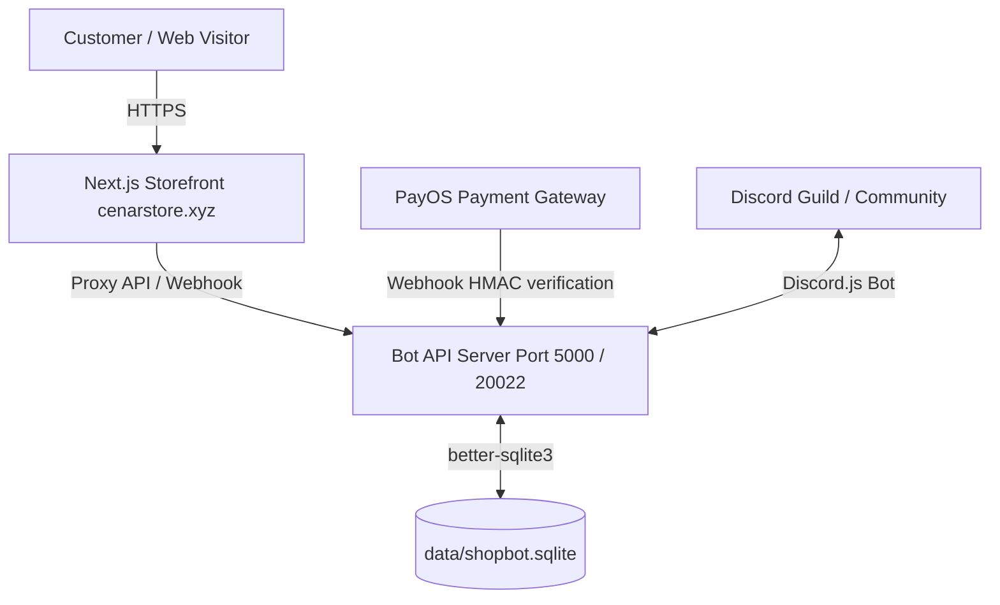

# Cenar Store - System Architecture

## Overview
Cenar Store is a high-performance automated digital marketplace built with:
- **Frontend / Storefront**: Next.js 14 (App Router) + Tailwind CSS + Framer Motion (`cenar-website-main`)
- **Backend / Bot Core**: Node.js + Discord.js + Express API Server + SQLite (`Cream-Store-Bot-main`)

## Architecture Diagram

## Data Synchronization
- The Bot Repository (`Cream-Store-Bot-main`) is the single point of truth for order status, stock inventory, and customer transactions.
- The Website proxies product lookup (`/api/products/[slugOrId]`) and order verification (`/api/order/[code]`) directly to the Bot API server.
